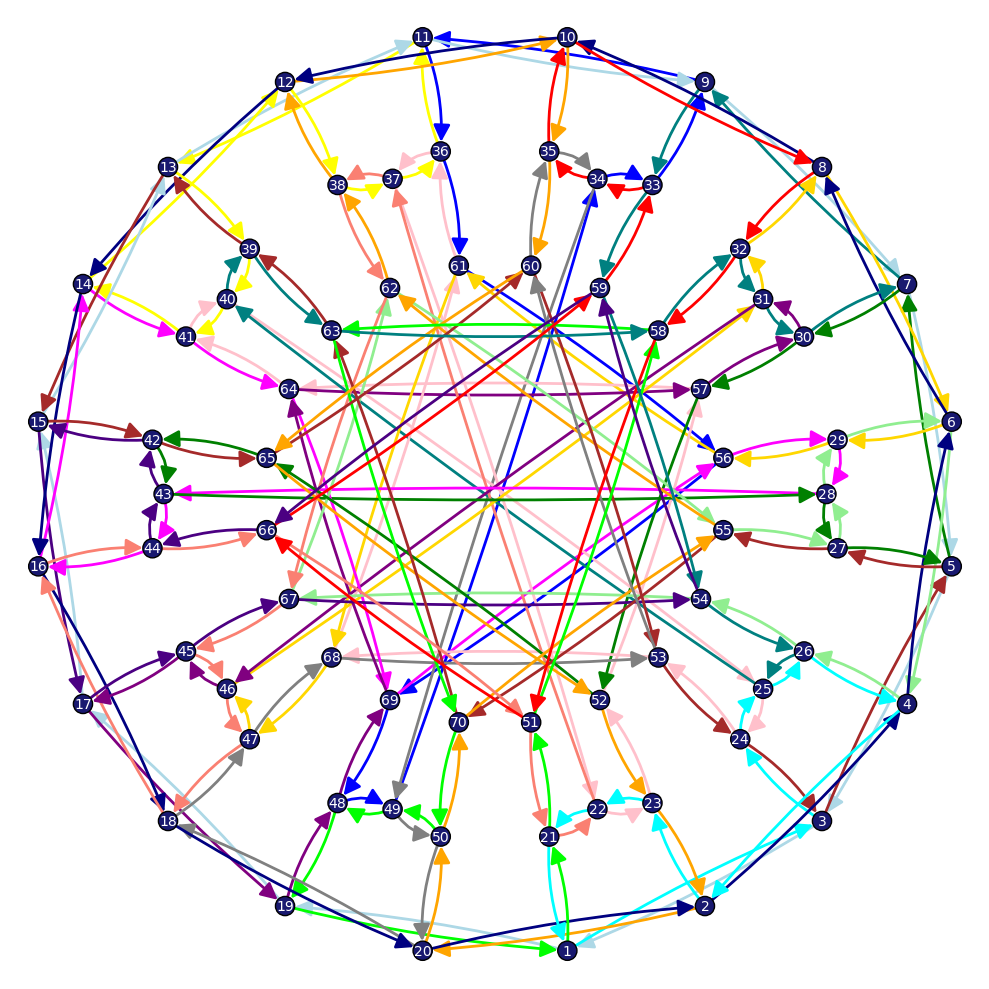

<!--
    SPDX-FileCopyrightText: 2026 Alexander Metzger
    SPDX-License-Identifier: GPL-2.0-only
-->

# A Practical Algorithm for Graph Embedding (PAGE)
[](http://doi.org/10.1016/j.disc.2026.115308)
[](https://arxiv.org/abs/2411.07347)

This subfolder contains the official implementation of PAGE as developed by myself (Alexander Metzger) and Austin Ulrigg.

## Properties of PAGE (our algorithm)
PAGE has a number of practical properties for real-world use:

1) **Verification**: The algorithm outputs not only the genus but also the corresponding rotation system that defines the surface embedding that achieves this minimum genus. This allows for easy verification of the result both via a [Python script](verify_faces.py) and [visually](PAGE/visualize_faces.py):
[](../assets/19Cycles.png)

1) **Speed**: The algorithm can handle graphs with high genus much better than existing algorithms. It also takes effective advantage of the girth and cycle distribution of a graph to work very well in practice. PAGE, for instance, completes the (3, 10) Cages in a few seconds whereas SageMath doesn't finish in weeks and multi_genus takes hours. See [more benchmarks here](../docs/practical_performance.md) and [theoretical worst case performance here](../docs/time_complexity.md).

1) **Progressively Narrowing Bounds**: The algorithm can iterate through possible embeddings in heuristic order and progressively narrow the bounds on the genus. This allows for early stopping if only an estimate is needed.

1) **Easily Parallelizable**: The algorithm can be easily parallelized since a parallelizable cycle finding algorithm is chosen and the search needs to go through each possible start cycle (which can be done in parallel). This allows for a speedup proportional to the number of cores available.

1) **Simplicity of Implementation**: While there exist more efficient algorithms for certain graph families (e.g., multi_genus does better on lower genus high degree graphs), this algorithm is much simpler to implement (can be done in [a few hundred lines of code](page.py)).

## Usage
To run the C program for any graph, `cd PAGE` and run `S="0" DEG="3" ADJ="adjacency_lists/3-8-cage.txt" make run`. This will compile the C program and run it. The output will be in `page.out`. The format of the adjacency lists is the number of vertices and number of edges on the first line followed by the neighbors of each vertex on the following lines. See the examples in `PAGE/adjacency_lists/`. Use `MallocStackLogging=1 S="0" DEG="3" ADJ="adjacency_lists/3-8-cage.txt" leaks -quiet -atExit -- ./page` to check for memory leaks on macOS. Use `S=0 DEG=7 ADJ="adjacency_lists/coHerschel.txt" lldb --file ./page` and type `r` then `bt` to debug segmentation faults. If you're on Windows, you'll probably have an easier time if you use [WSL](https://learn.microsoft.com/en-us/windows/wsl/install) or [MSYS](https://www.msys2.org/).

To run the `.py` scripts, you'll need [Python 3](https://www.python.org/downloads/) for the scripts that show `#!/usr/bin/env python3` at the top and [SageMath](https://doc.sagemath.org/html/en/installation/index.html) for the scripts that show `#!/usr/bin/env sage` at the top. For example,
- run the simplified python PAGE implementation using `S=0 DEG=3 ADJ=adjacency_lists/k3-3.txt python3 page.py`
- and run verifications on the output faces using `sage verify_faces.py`

## Citation
```bibtex
@article{Metzger_2026,
   title={An efficient genus algorithm based on graph rotations},
   volume={349},
   ISSN={0012-365X},
   url={http://doi.org/10.1016/j.disc.2026.115308},
   DOI={10.1016/j.disc.2026.115308},
   number={12},
   journal={Discrete Mathematics},
   publisher={Elsevier BV},
   author={Metzger, Alexander and Ulrigg, Austin},
   year={2026},
   month=Dec, pages={115308}
}
```

## License
This project is licensed under the terms of the **GNU General Public License v2.0** (GPLv2). 
See the [LICENSE](../LICENSE) file for the full text.
