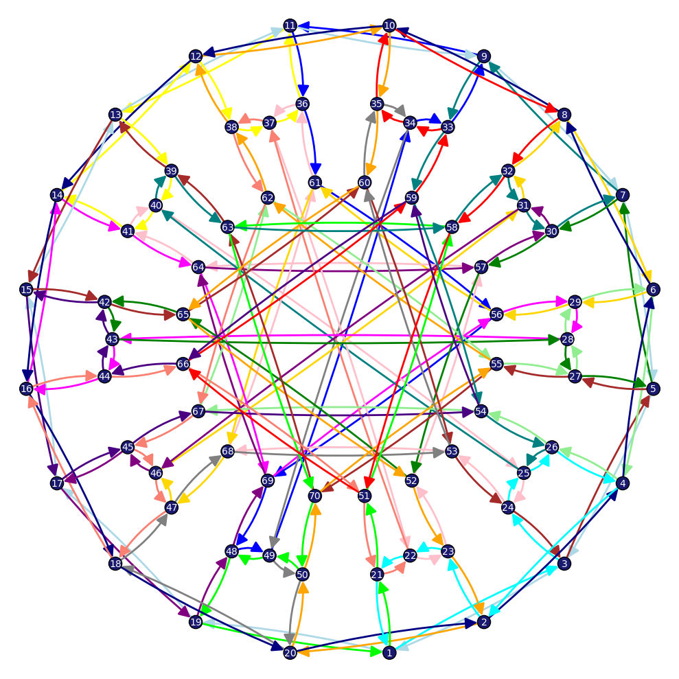
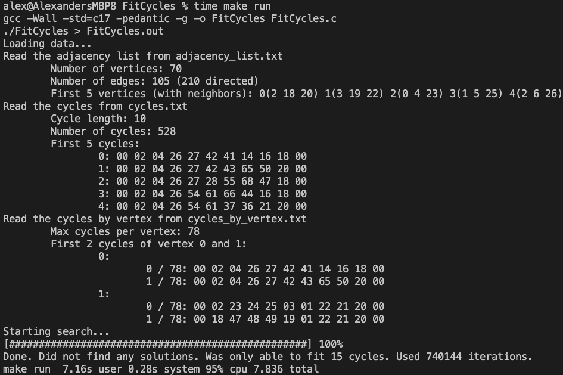

# Ever wondered what the genus of the Balaban 10 cage is?

Unless "automorphism" and "graph cycles" are part of your daily vocabulary, you probably haven't. But if you have, the answer is 9.

These are the scripts/programs used to calculate it. I wrote the FitCycles scripts that determined the genus (based on ideas for an algorithm by [Austin](https://austinulrigg.github.io/)) and the ReverseCycle utility program to convert it into a format that the CalcCycles programs could use to check the solution. The CalcCycles programs were written by [Sam King](https://www.linkedin.com/in/samkingwa/). Austin did the main work in deciphering the math and checking the solution manually. Also credit to the rest of the recreational math group at the University of Washington for input on the programs/math and for providing computational resources for experimentation.

## How it works
Read more about the mathematical graph theory context in [Pearls in Graph Theory - A Comprehensive Introduction - By Nora Hartsfield and Gerhard Ringel](https://proofits.wordpress.com/wp-content/uploads/2012/09/nora_hartsfield_gerhard_ringel_pearls_in_graph.pdf) (particularly Chapter 10). In short, the problem boils down to "fitting" as many simple directed cycles (that are not just one edge) onto the 10 Cage graph as possible. Fitting just means that together, the cycles should use each directed edge exactly once. The shortest cycle is 10 edges long (there are 528 of these counting both orientations) and there are 210 edges (counting both directions) to fit. The maximum number of fitting cycles is therefore at most 210/10 = 21 which would correspond to a genus of 8. If 19 is the maximum number of cycles that can be fit, then the genus is 9. This comes from [Euler's Formula](https://en.wikipedia.org/wiki/Euler_characteristic), F - E + V = 2 - 2g, where E is the number of edges (105), V is the number of vertices (70), g is the genus and F is the number of faces (the number of cycles we can fit also known as circuits in Chapter 10 of the book). To rule out the possibility of a genus of 8, it seems at first that you would need to check all 528 choose 21 possible combinations of 10 edge cycles which would not be feasible. However, Austin came up with a sequence of case work to show that it is impossible to fit 21 cycles. This uses the automorphisms of the graph to deduce a 10 edge cycle that must be part of a 21 cycle fitting if one exists. It then keeps adding cycles using some clever constraints to fail early (each vertex must be used exactly 3 times, if the sequence i -> j -> k occurs in a cycle it can't occur in reverse in another cycle in the fitting, etc.). This requires about 100K cases to be checked so I wrote a program to check all the cases (see the simple but inefficient algorithm [in python](Balaban10/austin_adj_no_21.ipynb) or the optimized [C implementation](Balaban10/FitCycles.c) for details).

To find an example fitting with 19 cycles, I figured out how to modify Austin's algorithm to find the maximum fitting given a range of cycle lengths (see the implementation [in python](Balaban10/austin_adj_max_fit.ipynb)). Turns out finding such an example only requires up to length 14 cycles to be checked which is feasible to compute (computing with all the cycles would take too long to finish in a realistic amount of time because they quickly grow into the thousands). I then wrote a script to test the solution and visualize it [in python](Balaban10/test.ipynb) and others further tested both by hand and with the Java programs in the CalcCycles directory.

For comparison, the SageMath code to find the genus of a Balaban 10 cage has been computing for a week and still hasn't finished. So this 7 second C algorithm is a significant improvement. There is also a [complete C implementation](Balaban10C/FitCycles.c) that only needs an adjacency list and can generate the cycles and other auxiliary data structures automatically.

## Extending the algorithm to any graph

Coming soon...

## How to run

To run the C program for ruling out genus 8 for the Balaban 10 Cage, `cd Balaban10` and run `make run`. This will compile the C program and run it. The output will be in `FitCycles.out`. To run with a different vertex labeling or set of cycles, modify `generate.ipynb` or `generate_austin.ipynb` and run the notebook to generate the input files. Then run `make run` again. To run the complete C version that doesn't require python to generate the cycles, `cd Balaban10C` and run `make run`. 

To run the python scripts you must have [SageMath installed](https://doc.sagemath.org/html/en/installation/index.html) and select the SageMath kernel in Jupyter/VS Code/whatever you use. Then run the notebooks in the Balaban10 directory.
