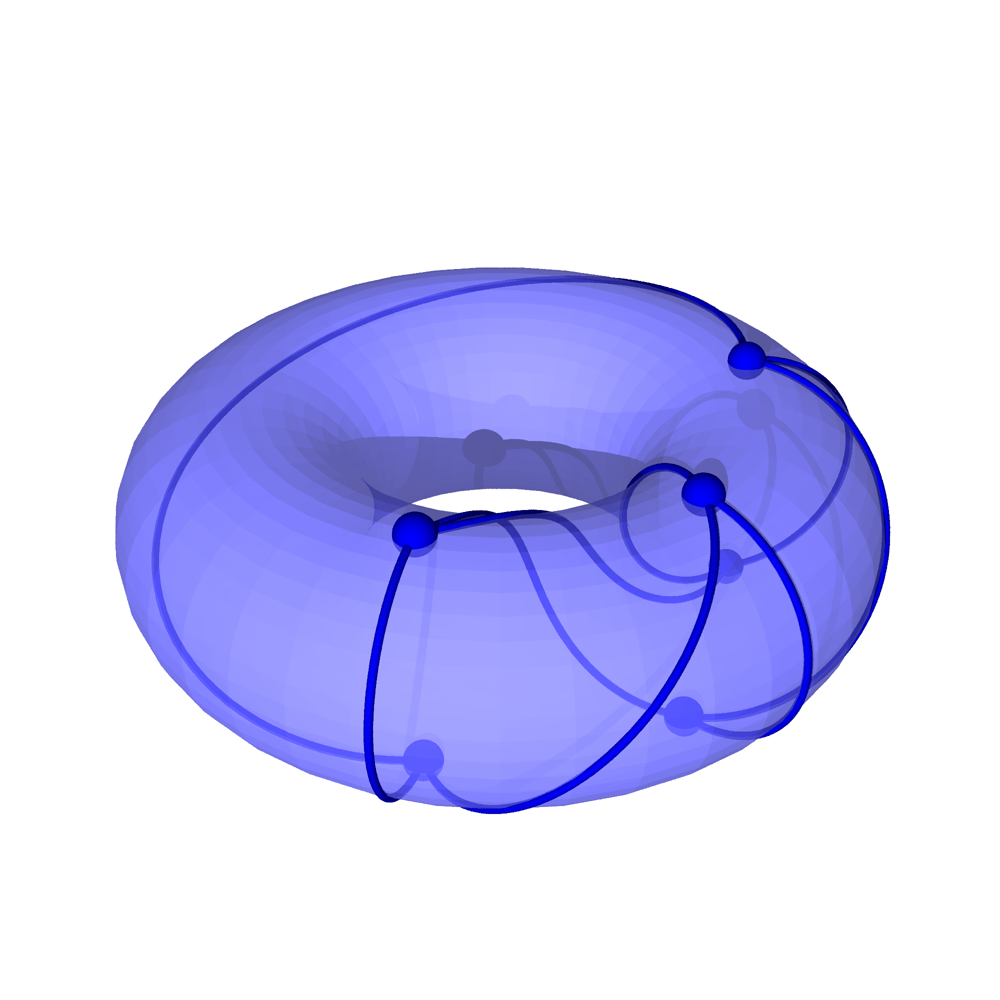

# A Practical Algorithm for Graph Embedding (PAGE)
[](http://doi.org/10.1016/j.disc.2026.115308)
[](https://arxiv.org/abs/2411.07347)
[](https://gist.github.com/taiki-e/ad73eaea17e2e0372efb76ef6b38f17b)

A famous problem at the intersection of topology and combinatorial graph theory is the [Utility Problem](https://www.youtube.com/watch?v=VvCytJvd4H0). Say you have three houses and three utilities and you need to connect each house to each utility via a wire. Is there a way to do this without the wires crossing? In terms of graph theory, this is asking whether K3,3 is _planar_. It is known that it is not. In fact K3,3 is _toroidal_ meaning while it cannot be embedded on a plane without edges crossing, it can be embedded on a torus:

[](images/k3-3torus.png)

The characterizing property of a torus that allows us to embed K3,3 is that it has a hole (unlike surfaces such as a plane or a sphere). This motivates classifying surfaces by their number of holes, that is, their genus g. The genus of a graph G is then simply the genus of the minimum genus surface on which G can be embedded without edges crossing. For genus zero we use the special name _planar_ and for genus one we use _toroidal_. Calculating the genus of a graph has a number of applications, particularly in the design of integrated circuits, study of graph minors, VLSI design, infrastructure planning, and more. For an interactive visualization of graph embedding [check here](https://genus.sandergi.com/k33_rotation_animation.html).

## Properties of PAGE (our algorithm)

This repo contains a fast algorithm for calculating the genus of arbitrary graphs. It has a number of properties that make it practical for real-world use:

1) **Verification**: The algorithm outputs not only the genus but also the corresponding rotation system that defines the surface embedding that achieves this minimum genus. This allows for easy verification of the result both via a [Python script](PAGE/verify_faces.py) and [visually](PAGE/visualize_faces.py):
[](images/19Cycles.png)

1) **Speed**: The algorithm can handle graphs with high genus much better than existing algorithms. It also takes effective advantage of the girth and cycle distribution of a graph to work very well in practice. PAGE, for instance, completes the (3, 10) Cages in a few seconds whereas SageMath doesn't finish in weeks and `multi_genus` takes hours. See [more benchmarks here](docs/practical_performance.md) and [theoretical worst case performance here](docs/time_complexity.md).

1) **Progressively Narrowing Bounds**: The algorithm can iterate through possible embeddings in heuristic order and progressively narrow the bounds on the genus. This allows for early stopping if only an estimate is needed.

1) **Easily Parallelizable**: The algorithm can be easily parallelized since a parallelizable cycle finding algorithm is chosen and the search needs to go through each possible start cycle (which can be done in parallel). This allows for a speedup proportional to the number of cores available.

1) **Simplicity of Implementation**: While there exist more efficient algorithms for certain graph families (e.g., `multi_genus` does better on lower genus high degree graphs), this algorithm is much simpler to implement (can be done in [a few hundred lines of code](PAGE/page.py)).

## Usage

The easiest way is to use the [hosted version](https://genus.sandergi.com/). This won't be as fast as running it locally and I can't guarantee it will always be up, but it should allow you to explore the algorithm. You can also self-host the web application by [installing docker](https://docs.docker.com/get-docker/) and running `cd WebApp` followed by `. ./run-dev.sh`. This will start the web application on `localhost:8080`.

To run the python scripts you must have [SageMath installed](https://doc.sagemath.org/html/en/installation/index.html) and select the SageMath kernel in Jupyter/VS Code/whatever you use.

To run the C program for any graph, `cd PAGE` and run `S="0" DEG="3" ADJ="adjacency_lists/3-8-cage.txt" make run`. This will compile the C program and run it. The output will be in `page.out`. The format of the adjacency lists is the number of vertices and number of edges on the first line followed by the neighbors of each vertex on the following lines. See the examples in `PAGE/adjacency_lists/`. Use `MallocStackLogging=1 S="0" DEG="3" ADJ="adjacency_lists/3-8-cage.txt" leaks -quiet -atExit -- ./page` to check for memory leaks on macOS. Use `S=0 DEG=7 ADJ="adjacency_lists/coHerschel.txt" lldb --file ./page` and type `r` then `bt` to debug segmentation faults. If you're on Windows, you'll probably have an easier time if you use [WSL](https://learn.microsoft.com/en-us/windows/wsl/install) or [MSYS](https://www.msys2.org/).

## Acknowledgements

[Austin](https://austinulrigg.github.io/) did the main work in deciphering the math and checking the solutions manually. He also contributed intellectually to the ideas behind the algorithm.

Thanks to [Professor Steinerberger](https://faculty.washington.edu/steinerb/) for guidance on the project, and thanks to [Professor Brinkmann](https://scholar.google.be/citations?user=yaEBOB4AAAAJ&hl=nl) for providing a fast SoTA algorithm `multi_genus` to compare against and recommendations for visualizing results.

## Citation
If you use the PAGE algorithm or other code/visualizations from this repository, please cite:
```bibtex
@article{Metzger_2026,
   title={An efficient genus algorithm based on graph rotations},
   volume={349},
   ISSN={0012-365X},
   url={http://doi.org/10.1016/j.disc.2026.115308},
   DOI={10.1016/j.disc.2026.115308},
   number={12},
   journal={Discrete Mathematics},
   publisher={Elsevier BV},
   author={Metzger, Alexander and Ulrigg, Austin},
   year={2026},
   month=Dec, pages={115308}
}
```
You may also want to check out [the literature](docs/references.md) this work is based on.
