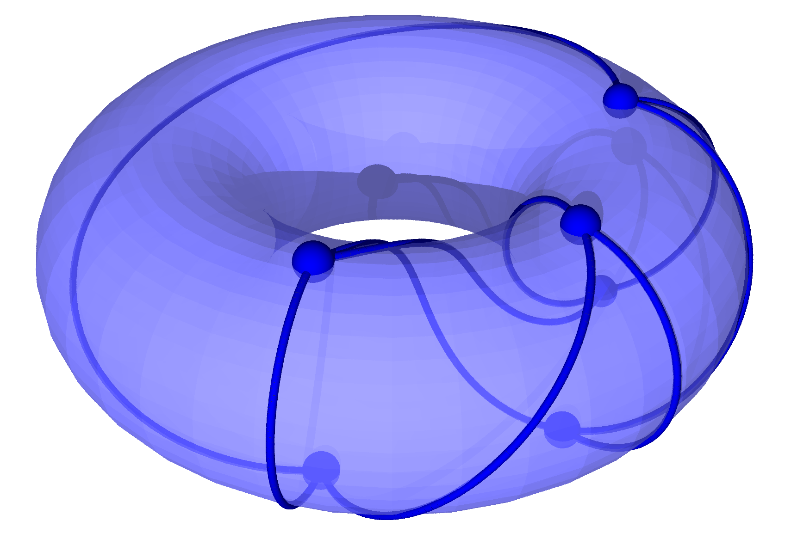

# A Practical Algorithm for Graph Embedding (PAGE)

A famous problem at the intersection of topology and combinatorial graph theory is the [Utility Problem](https://www.youtube.com/watch?v=VvCytJvd4H0). Say you have three houses and three utilities and you need to connect each house to each utility via a wire. Is there a way to do this without the wires crossing? In terms of graph theory, this is asking whether K3,3 is _planar_. It is known that it is not. In fact K3,3 is _toroidal_ meaning while it cannot be embedded on a plane without edges crossing, it can be embedded on a torus:

The characterizing property of a torus that allows us to embed K3,3 is that it has a hole (unlike surfaces such as a plane or a sphere). This motivates classifying surfaces by their number of holes, that is, their genus g. The genus of a graph G is then simply the genus of the minimum genus surface on which G can be embedded without edges crossing. For genus zero we use the special name _planar_ and for genus one we use _toroidal_. Calculating the genus of a graph has a number of applications, particularly in the design of integrated circuits, study of graph minors, VLSI design, infrastructure planning, and more.

## Properties of this algorithm

This repo contains a fast algorithm for calculating the genus of arbitrary graphs. It has a number of properties that make it practical for real-world use:

1) **Verification**: The algorithm outputs not only the genus but also the corresponding rotation system that defines the surface embedding that achieves this minimum genus. This allows for easy verification of the result both via a [Python script](CalcGenus/verifyEmbedding.ipynb) and visually:

2) **Progressively Narrowing Bounds**: The algorithm iterates through possible embeddings and progressively narrows the bounds on the genus. This allows for early stopping if only an estimate is needed.

3) **Simplicity of Implementation**: While there exist more efficient algorithms for certain graph families (e.g., `multi_genus` does better on lower genus high degree graphs), this algorithm is much simpler to implement (can be done in a few dozen lines of Python or a few hundred lines of C).

4) **Scales Well With Genus**: The algorithm can handle graphs with high genus much better than existing algorithms. It can for instance complete the (3, 10) Cages in a few minutes whereas SageMath doesn't finish in weeks and `multi_genus` takes hours. It does not, however, scale as well with degree as `multi_genus` for low genus graphs, so there is a tradeoff and the optimal algorithm depends on both the genus and degree of the graph.

5) **Easily Parallelizable**: The algorithm can be easily parallelized since a parallelizable cycle finding algorithm is chosen and the search needs to go through each possible start cycle (which can be done in parallel). This allows for a speedup proportional to the number of cores available.

## Usage

To run the python scripts you must have [SageMath installed](https://doc.sagemath.org/html/en/installation/index.html) and select the SageMath kernel in Jupyter/VS Code/whatever you use.

To run the C program for any graph, `cd CalcGenus` and run `S="0" DEG="3" ADJ="adjacency_lists/3-8-cage.txt" make run`. This will compile the C program and run it. The output will be in `CalcGenus.out`. The format of the adjacency lists is the number of vertices and number of edges on the first line followed by the neighbors of each vertex on the following lines. See the examples in `CalcGenus/adjacency_lists/`.

## Time Complexity

Let `V` be the number of vertices and `E` the number of edges. The [current SageMath algorithm](https://github.com/sagemath/sage/blob/develop/src/sage/graphs/genus.pyx) claims `O(V \prod_{v \in V(G)} (deg(v)-1)!)` runtime. This simplifies to `O(2^V)` for 3-regular graphs, and `O(V(V-1)!^{V})` for complete graphs. 

The algorithm in this repository is roughly `O(2^(V^2 + 3V)/V^(V + 1))` for complete graphs. It has some optimizations that allows it to stop early not captured in the below analysis.

- Finding all c elementary cycles of a graph: `O((c + 1)(V + E)) = O(cV + cE)` using Johnson's algorithm
- Organizing by vertex: `O(cV)` by iterating through the cycles of length at most V
- Iterating through all cycles of length k: `O(V!/k/(V-k)!)` since this is the number of k-length cycles in a complete graph. This is worst case `O(V!/((V/2)!)^2)` which is roughly `O(2^V)`.

- Find the most used vertex to explore: `O(V)` by iterating through the vertices (overall time complexity is better when write is kept `O(1)`)
- Looking up the cycles that use a vertex: `O(1)` via hashset lookup
- Checking if a cycle is used: `O(1)` via hashset lookup
- Checking if the edges of a cycle are used: `O(e)` where `e` is the number of edges in the cycle by storing the edges used in a hashset
- Checking ijk criterion of a cycle: `O(e)` by storing the current rotation with the adjacency list
- Search iteration (f = implied fit, b = cycles by vertex >= u = unused >= a = w/ edges available >= d = ijk good): `T(f) = O(V) + O(1) + b O(1) + u O(e) + a O(e) + d T(f-1); T(0) = 0` => `O(d^f * (V + b + u e + a e)) = O(d^f * (V + b + e(u + a))) < O(b^(f + 2))`
- All search iterations (n = number of start cycles to try out < `V 2^V`): `O(b^(f + 2) * n) < O((2^V/V)^(V + 2) * V 2^V) = O(2^(V^2 + 3V)/V^(V + 1))`

Except for very small graphs, this is a significant speedup of worst case performance. See below for the theoretical scaling factors (with columns normalized to start at 1):

V  | SageMath | This Algorithm | Speedup Factor
-- | -------- | -------------- | --------------
1  | 1        | 1              | 1.0
2  | 4        | 8              | 0.5
3  | 216      | 202            | 1.1
4  | 331776   | 16384          | 20
5  | 2.5e10   | 4.4e6          | 5700
6  | 1.4e17   | 4.0e9          | 3.5e7
7  | 8.3e25   | 1.3e13         | 6.5e12
8  | 7.0e36   | 1.4e17         | 4.8e19
9  | 1.1e50   | 5.8e21         | 1.9e28
10 | 4.0e65   | 8.5e26         | 4.7e38
11 | 4.1e83   | 4.5e32         | 9.0e50
12 | 1.5e104  | 9.0e38         | 1.6e65
13 | 2.1e127  | 6.5e45         | 3.2e81
14 | 1.5e153  | 1.8e53         | 8.3e99
15 | 5.6e181  | 1.8e61         | 3.1e120
16 | 1.3e213  | 6.9e69         | 2.0e143
17 | 2.3e247  | 1.0e79         | 2.3e168
18 | 3.3e284  | 5.4e88         | 6.0e195

## Practical Performance

The genus for various cage graphs using the adjacency lists from [win.tue.nl](https://www.win.tue.nl/~aeb/graphs/cages/cages.html). Number (\# links to adjacency list), valency (k), girth (g), vertices (v), edges (e), size of the automorphism group (\|G\|), genus, computation time for the genus (time), computation time for the genus using SageMath (SM time), and computation time using multi_genus.c (MG time).
\#                                                | k   | g   | v    | e     | \|G\|      | genus      | time (s) | SM time (s) | MG time (s)
------------------------------------------------- | --- | --- | ---- | ----- | ---------- | ---------- | -------- | ----------- | -----------
[1/1](CalcGenus/adjacency_lists/3-3-cage.txt)     | 3   | 3   | 4    | 6     | 24         | 0          | 0.008    | 0.004       | 0.006
[1/1](CalcGenus/adjacency_lists/3-4-cage.txt)     | 3   | 4   | 6    | 9     | 72         | 1          | 0.008    | 0.039       | 0.006
[1/1](CalcGenus/adjacency_lists/3-5-cage.txt)     | 3   | 5   | 10   | 15    | 120        | 1          | 0.008    | 0.027       | 0.006
[1/1](CalcGenus/adjacency_lists/3-6-cage.txt)     | 3   | 6   | 14   | 21    | 336        | 1          | 0.008    | 0.010       | 0.006
[1/1](CalcGenus/adjacency_lists/3-7-cage.txt)     | 3   | 7   | 24   | 36    | 32         | 2          | 0.010    | 1.737       | 0.006
[1/1](CalcGenus/adjacency_lists/3-8-cage.txt)     | 3   | 8   | 30   | 45    | 1440       | 4          | 0.032    | 118.958     | 0.012
[1/18](CalcGenus/adjacency_lists/3-9-cage1.txt)   | 3   | 9   | 58   | 87    | 4          | 7          | 1.954    | days        | 29.084
[2/18](CalcGenus/adjacency_lists/3-9-cage2.txt)   | 3   | 9   | 58   | 87    | 2          | 7          | 7.666    | days        | 30.909
[3/18](CalcGenus/adjacency_lists/3-9-cage3.txt)   | 3   | 9   | 58   | 87    | 24         | 7          | 99.05    | days        | 25.993
[4/18](CalcGenus/adjacency_lists/3-9-cage4.txt)   | 3   | 9   | 58   | 87    | 4          | 7          | 2.251    | days        | 54.396
[5/18](CalcGenus/adjacency_lists/3-9-cage5.txt)   | 3   | 9   | 58   | 87    | 4          | 7          | 1.918    | days        | 67.89
[6/18](CalcGenus/adjacency_lists/3-9-cage6.txt)   | 3   | 9   | 58   | 87    | 2          | 7          | 0.436    | days        | 45.310
[7/18](CalcGenus/adjacency_lists/3-9-cage7.txt)   | 3   | 9   | 58   | 87    | 1          | 7          | 1.331    | days        | 37.257
[8/18](CalcGenus/adjacency_lists/3-9-cage8.txt)   | 3   | 9   | 58   | 87    | 2          | 7          | 0.973    | days        | 42.843
[9/18](CalcGenus/adjacency_lists/3-9-cage9.txt)   | 3   | 9   | 58   | 87    | 1          | 7          | 2.137    | days        | 34.437
[10/18](CalcGenus/adjacency_lists/3-9-cage10.txt) | 3   | 9   | 58   | 87    | 2          | 7          | 0.670    | days        | 86.54
[11/18](CalcGenus/adjacency_lists/3-9-cage11.txt) | 3   | 9   | 58   | 87    | 1          | 7          | 0.525    | days        | 54.990
[12/18](CalcGenus/adjacency_lists/3-9-cage12.txt) | 3   | 9   | 58   | 87    | 2          | 7          | 2.439    | days        | 51.589
[13/18](CalcGenus/adjacency_lists/3-9-cage13.txt) | 3   | 9   | 58   | 87    | 1          | 7          | 3.047    | days        | 32.340
[14/18](CalcGenus/adjacency_lists/3-9-cage14.txt) | 3   | 9   | 58   | 87    | 12         | 7          | 0.756    | days        | 30.824
[15/18](CalcGenus/adjacency_lists/3-9-cage15.txt) | 3   | 9   | 58   | 87    | 8          | 7          | 0.992    | days        | 44.888
[16/18](CalcGenus/adjacency_lists/3-9-cage16.txt) | 3   | 9   | 58   | 87    | 2          | 7          | 0.817    | days        | 57.890
[17/18](CalcGenus/adjacency_lists/3-9-cage17.txt) | 3   | 9   | 58   | 87    | 6          | 7          | 169.66   | days        | 140.50
[18/18](CalcGenus/adjacency_lists/3-9-cage18.txt) | 3   | 9   | 58   | 87    | 6          | 7          | 1.083    | days        | 47.737
[1/3](CalcGenus/adjacency_lists/3-10-cage1.txt)   | 3   | 10  | 70   | 105   | 120        | 9          | 36.531   | DNF         | 9354.14
[2/3](CalcGenus/adjacency_lists/3-10-cage2.txt)   | 3   | 10  | 70   | 105   | 24         | 9          | 44.043   | DNF         | 9556.13
[3/3](CalcGenus/adjacency_lists/3-10-cage3.txt)   | 3   | 10  | 70   | 105   | 80         | 9          | 37.058   | DNF         | 10680.89
[1/1](CalcGenus/adjacency_lists/3-11-cage.txt)    | 3   | 11  | 112  | 168   | 64         | [14, 19]   | days     | DNF         | days
[1/1](CalcGenus/adjacency_lists/3-12-cage.txt)    | 3   | 12  | 126  | 189   | 12096      | 17         | 254.45   | DNF         | days
[1/1](CalcGenus/adjacency_lists/4-5-cage.txt)     | 4   | 5   | 19   | 38    | 24         | 4          | 0.047    | days        | 0.019
[1/1](CalcGenus/adjacency_lists/4-6-cage.txt)     | 4   | 6   | 26   | 52    | 11232      | 5          | 0.288    | DNF         | 0.013
[1/?](CalcGenus/adjacency_lists/4-7-cage1.txt)    | 4   | 7   | 67   | 134   | 4          | [16, 21]   | days     | DNF         | days
[1/1](CalcGenus/adjacency_lists/4-8-cage.txt)     | 4   | 8   | 80   | 160   | 51840      | [21, 27]   | days     | DNF         | days
[1/?](CalcGenus/adjacency_lists/4-12-cage1.txt)   | 4   | 12  | 728  | 1456  | 8491392    | [244, 363] | DNF      | DNF         | too big for bit operations
[1/4](CalcGenus/adjacency_lists/5-5-cage1.txt)    | 5   | 5   | 30   | 75    | 120        | [9, 10]    | days     | DNF         | days
[2/4](CalcGenus/adjacency_lists/5-5-cage2.txt)    | 5   | 5   | 30   | 75    | 20         | [9, 13]    | days     | DNF         | days
[3/4](CalcGenus/adjacency_lists/5-5-cage3.txt)    | 5   | 5   | 30   | 75    | 30         | [9, 14]    | days     | DNF         | days
[4/4](CalcGenus/adjacency_lists/5-5-cage4.txt)    | 5   | 5   | 30   | 75    | 96         | [9, 14]    | days     | DNF         | days
[1/1](CalcGenus/adjacency_lists/5-6-cage.txt)     | 5   | 6   | 42   | 105   | 241920     | [15, 17]   | days     | DNF         | days
[1/1](CalcGenus/adjacency_lists/5-8-cage.txt)     | 5   | 8   | 170  | 425   | 3916800    | [76, 126]  | DNF      | DNF         | too big for bit operations
[1/?](CalcGenus/adjacency_lists/5-12-cage1.txt)   | 5   | 12  | 2730 | 6825  | 503193600  |[1480, 2048]| OOM      | DNF         | too big for bit operations
[1/1](CalcGenus/adjacency_lists/6-5-cage.txt)     | 6   | 5   | 40   | 120   | 480        | [17, 22]   | days     | DNF         | days
[1/1](CalcGenus/adjacency_lists/6-6-cage.txt)     | 6   | 6   | 62   | 186   | 744000     | [32, 60]   | DNF      | DNF         | DNF
[1/1](CalcGenus/adjacency_lists/6-8-cage.txt)     | 6   | 8   | 312  | 936   | 9360000    | [196, 310] | DNF      | DNF         | too big for bit operations
[1/?](CalcGenus/adjacency_lists/6-12-cage1.txt)   | 6   | 12  | 7812 | 23436 | 5859000000 |[5860, 7810]| OOM      | DNF         | too big for bit operations
[1/1](CalcGenus/adjacency_lists/7-5-cage.txt)     | 7   | 5   | 50   | 175   | 252000     | [29, 39]   | DNF      | DNF         | DNF
[1/1](CalcGenus/adjacency_lists/7-6-cage.txt)     | 7   | 6   | 90   | 315   | 15120      | [61, 110]  | DNF      | DNF         | DNF
  
The genus for various complete graphs generated using the `CompleteGraph` function in SageMath follows. 
\#                                       | k   | g   | v    | e     | \|G\|              | genus    | time (s) | SM time (s) | MG time (s)
---------------------------------------- | --- | --- | ---- | ----- | ------------------ | -------- | -------- | ----------- | -----------
[k2](CalcGenus/adjacency_lists/k2.txt)   | 1   | Inf | 2    | 1     | 2                  | 0        | ---      | 0.004       | ---
[k3](CalcGenus/adjacency_lists/k3.txt)   | 2   | 3   | 3    | 3     | 6                  | 0        | 0.008    | 0.004       | 0.008
[k4](CalcGenus/adjacency_lists/k4.txt)   | 3   | 3   | 4    | 6     | 24                 | 0        | 0.008    | 0.003       | 0.008
[k5](CalcGenus/adjacency_lists/k5.txt)   | 4   | 3   | 5    | 10    | 120                | 1        | 0.008    | 0.005       | 0.008
[k6](CalcGenus/adjacency_lists/k6.txt)   | 5   | 3   | 6    | 15    | 720                | 1        | 0.008    | 0.023       | 0.008
[k7](CalcGenus/adjacency_lists/k7.txt)   | 6   | 3   | 7    | 21    | 5040               | 1        | 0.009    | days        | 0.009
[k8](CalcGenus/adjacency_lists/k8.txt)   | 7   | 3   | 8    | 28    | 40320              | 2        | 2.885    | DNF         | 0.008
[k9](CalcGenus/adjacency_lists/k9.txt)   | 8   | 3   | 9    | 36    | 362880             | 3        | days     | DNF         | 0.008

The genus for various complete bipartite graphs generated using the `CompleteBipartiteGraph` function in SageMath follows. Number (\# links to adjacency list), valency (k), girth (g), vertices (v), edges (e), size of the automorphism group (\|G\|), genus, computation time for the genus (time), and computation time for the genus using SageMath (SM time).
\#                                         | k   | g   | v    | e     | \|G\|        | genus    | time (s) | SM time (s) | MG time (s)
------------------------------------------ | --- | --- | ---- | ----- | ------------ | -------- | -------- | ----------- | -----------
[k3-3](CalcGenus/adjacency_lists/k3-3.txt) | 3   | 4   | 6    | 9     | 72           | 1        | 0.009    | 0.047       | 0.006
[k4-4](CalcGenus/adjacency_lists/k4-4.txt) | 4   | 4   | 8    | 16    | 1152         | 1        | 0.009    | 0.010       | 0.010 
[k5-5](CalcGenus/adjacency_lists/k5-5.txt) | 5   | 4   | 10   | 25    | 28800        | 3        | 0.073    | DNF         | 0.008
[k6-6](CalcGenus/adjacency_lists/k6-6.txt) | 6   | 4   | 12   | 36    | 1036800      | 4        | 0.015    | DNF         | 0.009

The genus for various complete n-partite graphs generated using the `CompleteMultipartiteGraph` function in SageMath follows.
\#                                                                               | v    | e     | genus    | time (s) | MG time (s)
-------------------------------------------------------------------------------- | ---- | ----- | -------- | -------- | -----------
[k2-2](CalcGenus/adjacency_lists/k2-2.txt)                                       | 4    | 4     | 0        | 0.007    | 0.008
[k2-2-2](CalcGenus/adjacency_lists/k2-2-2.txt)                                   | 6    | 12    | 0        | 0.009    | 0.009
[k2-2-2-2](CalcGenus/adjacency_lists/k2-2-2-2.txt)                               | 8    | 24    | 1        | 0.008    | 0.009
[k2-2-2-2-2](CalcGenus/adjacency_lists/k2-2-2-2-2.txt)                           | 10   | 40    | 3        | 0.144    | 0.009

The genus for various Johnson graphs generated using Mathematica follows.
\#                                                                               | v    | e     | genus      | time (s) | MG time (s)
-------------------------------------------------------------------------------- | ---- | ----- | ---------- | -------- | -----------
[Johnson (5, 2)](CalcGenus/adjacency_lists/Johnson5-2.txt)                       | 10   | 30    | 2          | 0.112    | 0.009
[Johnson (6, 2)](CalcGenus/adjacency_lists/Johnson6-2.txt)                       | 15   | 60    | [4, 5]     | hours    | hours
[Johnson (6, 3)](CalcGenus/adjacency_lists/Johnson6-3.txt)                       | 20   | 90    | [7, 9]     | hours    | hours
[Johnson (8, 4)](CalcGenus/adjacency_lists/Johnson8-4.txt)                       | 70   | 560   | [60,238]   | days     | too big for bit operations
[Johnson (9, 4)](CalcGenus/adjacency_lists/Johnson9-4.txt)                       | 70   | 560   | [148,558]  | days     | too big for bit operations

The genus for various Circulant graphs generated using Mathematica follows.
\#                                                                    | v    | e     | genus    | time (s) | MG time (s)
----------------------------------------------------------------------| ---- | ----- | -------- | -------- | -----------
[C10_1,2,5](CalcGenus/adjacency_lists/Circulant10_1-2-5.txt)          | 10   | 25    | 1        | 0.012    | 0.007
[C10_1,2,4,5](CalcGenus/adjacency_lists/Circulant10_1-2-4-5.txt)      | 10   | 35    | 3        | 9.164    | 0.023
[C14_1,2,3,6](CalcGenus/adjacency_lists/Circulant14_1-2-3-6.txt)      | 14   | 48    | 4        | hours    | 0.896
[C15_1,5](CalcGenus/adjacency_lists/Circulant15_1-5.txt)              | 15   | 30    | 1        | hours    | 0.006
[C16_1,7](CalcGenus/adjacency_lists/Circulant16_1-7.txt)              | 16   | 32    | 1        | 0.008    | 0.014
[C18_1,3,9](CalcGenus/adjacency_lists/Circulant18_1-3-9.txt)          | 18   | 45    | 4        | hours    | 0.021
[C20_1,3,5](CalcGenus/adjacency_lists/Circulant20_1-3-5.txt)          | 20   | 60    | 6        | 0.443    | 13.698
[C20_1,6,9](CalcGenus/adjacency_lists/Circulant20_1-6-9.txt)          | 20   | 60    | 6        | 0.031    | 20.637
[C21_1,4,5](CalcGenus/adjacency_lists/Circulant21_1-4-5.txt)          | 21   | 63    | 1        | 0.008    | 0.008
[C26_1,3,9](CalcGenus/adjacency_lists/Circulant26_1-3-9.txt)          | 26   | 78    | [8, 27]  | hours    | hours
[C30_1,9,11](CalcGenus/adjacency_lists/Circulant30_1-9-11.txt)        | 30   | 90    | [9, 31]  | hours    | hours
[C30_1,4,11,14](CalcGenus/adjacency_lists/Circulant30_1-4-11-14.txt)  | 30   | 120   | [16, 20] | hours    | hours
[C31_1,5,6](CalcGenus/adjacency_lists/Circulant31_1-5-6.txt)          | 31   | 93    | 1        | 0.008    | 0.006
[C20_*](CalcGenus/adjacency_lists/Circulant20_1-3-5-7-9-10.txt)       | 20   | 110   | [10, 17] | hours    | hours

The genus for various Cyclotomic graphs generated using Mathematica follows.
\#                                                                    | v    | e     | genus    | time (s) | MG time (s)
----------------------------------------------------------------------| ---- | ----- | -------- | -------- | -----------
[16](CalcGenus/adjacency_lists/Cyclotomic16.txt)                      | 16   | 40    | 4        | 0.513    | 0.042
[19](CalcGenus/adjacency_lists/Cyclotomic19.txt)                      | 19   | 57    | 1        | 0.008    | 0.010
[31](CalcGenus/adjacency_lists/Cyclotomic31.txt)                      | 31   | 155   | [12,58]  | hours    | hours
[61](CalcGenus/adjacency_lists/Cyclotomic61.txt)                      | 61   | 610   | [73,265] | days     | too big for bit operations
[67](CalcGenus/adjacency_lists/Cyclotomic67.txt)                      | 67   | 737   | [91,325] | days     | too big for bit operations

The genus for various DifferenceSetIncidence graphs generated using Mathematica follows.
\#                                                                               | v    | e     | genus    | time (s) | MG time (s)
-------------------------------------------------------------------------------- | ---- | ----- | -------- | -------- | -----------
[11,5,2](CalcGenus/adjacency_lists/DifferenceSetIncidence11-5-2.txt)             | 22   | 55    | 5        | hours    | 1.770
[40,13,4](CalcGenus/adjacency_lists/DifferenceSetIncidence40-13-4.txt)           | 80   | 520   | [91,214] | hours    | too big for bit operations

The genus for various Bipartite Kneser graphs generated using Mathematica follows.
\#                                                                               | v    | e     | genus     | time (s)                         | MG time (s)
-------------------------------------------------------------------------------- | ---- | ----- | --------- | -------------------------------- | -----------
[Bipartite Kneser (6, 2)](CalcGenus/adjacency_lists/bipartite-kneser6-2.txt)     | 30   | 90    | [9,28]    | days                             | days
[Bipartite Kneser (7, 2)](CalcGenus/adjacency_lists/bipartite-kneser7-2.txt)     | 42   | 210   | [33,80]   | days                             | days
[Bipartite Kneser (8, 2)](CalcGenus/adjacency_lists/bipartite-kneser8-2.txt)     | 56   | 420   | [78,175]  | days                             | days
[Bipartite Kneser (8, 3)](CalcGenus/adjacency_lists/bipartite-kneser8-3.txt)     | 112  | 560   | [85,143]  | days                             | too big for bit operations
[Bipartite Kneser (9, 2)](CalcGenus/adjacency_lists/bipartite-kneser9-2.txt)     | 72   | 756   | [154,332] | days                             | too big for bit operations
[Bipartite Kneser (9, 3)](CalcGenus/adjacency_lists/bipartite-kneser9-3.txt)     | 168  | 1680  | [337,338] | days                             | too big for bit operations
[Bipartite Kneser (10, 2)](CalcGenus/adjacency_lists/bipartite-kneser10-2.txt)   | 90   | 1260  | [271,572] | days                             | too big for bit operations
[Bipartite Kneser (10, 3)](CalcGenus/adjacency_lists/bipartite-kneser10-3.txt)   | 240  | 4200  | [931,1963]| days                             | too big for bit operations
[Bipartite Kneser (10, 4)](CalcGenus/adjacency_lists/bipartite-kneser10-4.txt)   | 420  | 3150  | [579,1358]| days                             | too big for bit operations
[Bipartite Kneser (11, 2)](CalcGenus/adjacency_lists/bipartite-kneser11-2.txt)   | 110  | 1980  | [441,918] | days                             | too big for bit operations
[Bipartite Kneser (11, 3)](CalcGenus/adjacency_lists/bipartite-kneser11-3.txt)   | 330  | 9240  |[2146,4428]| days                             | too big for bit operations
[Bipartite Kneser (11, 4)](CalcGenus/adjacency_lists/bipartite-kneser11-4.txt)   | 660  | 11550 |[2558,5428]| days                             | too big for bit operations
[Bipartite Kneser (12, 2)](CalcGenus/adjacency_lists/bipartite-kneser12-2.txt)   | 132  | 2970  | [677,1397]| days                             | too big for bit operations
[Bipartite Kneser (12, 3)](CalcGenus/adjacency_lists/bipartite-kneser12-3.txt)   | 440  | 18480 |[4401,8979]| days                             | too big for bit operations
[Bipartite Kneser (12, 4)](CalcGenus/adjacency_lists/bipartite-kneser12-4.txt)   | 990  | 34650 | ?         | adjacency list too large to load | too big for bit operations

The genus for various miscellaneous graphs generated using Mathematica follows.
\#                                                                               | v    | e     | genus    | time (s) | MG time (s)
-------------------------------------------------------------------------------- | ---- | ----- | -------- | -------- | -----------
[Klein Bottle](CalcGenus/adjacency_lists/KleinBottleTriangulation9-1.txt)        | 9    | 27    | 2        | 0.152    | 0.006
[TRC](CalcGenus/adjacency_lists/TriangleReplacedCoxeterGraph.txt)                | 84   | 126   | 3        | hours    | 0.006

## Acknowledgements

[Austin](https://austinulrigg.github.io/) did the main work in deciphering the math and checking the solutions manually. He also contributed intellectually to the ideas behind the algorithm.

The CalcCycles programs were written by [Sam King](https://www.linkedin.com/in/samkingwa/) and used to check the results of the algorithm for the Balaban 10 Cage.

Credit to the rest of the recreational math group at the University of Washington for input on the programs/math and for providing computational resources for experimentation.

Thanks to [Professor Steinerberger](https://faculty.washington.edu/steinerb/) for guidance on the project, and thanks to [Professor Brinkmann](https://scholar.google.be/citations?user=yaEBOB4AAAAJ&hl=nl) for providing a fast SoTA algorithm `multi_genus` to compare against and recommendations for visualizing results.

## References
- Adjacency Lists
    - [Win.tue.nl](https://www.win.tue.nl/~aeb/graphs/cages/cages.html)
    - [SageMath Generators](https://doc.sagemath.org/html/en/reference/graphs/sage/graphs/graph_generators.html)
    - [Mathematica](https://www.wolfram.com/mathematica/)
    - [ROME and other practical graph datasets](http://graphdrawing.org/data.html)

- Genus problem is NP-Hard
    - [The graph genus problem is NP-complete](https://www.sciencedirect.com/science/article/abs/pii/0196677489900060?via%3Dihub)
        - The general problem of determining the genus of a graph is NP-hard
    - [Triangulating a Surface with a Prescribed Graph](https://www.sciencedirect.com/science/article/pii/S0095895683710166)
        - Determining the non-orientable genus of a graph is NP-hard

- Background Information
    - [Rotation Systems](https://sites.math.washington.edu/~morrow/papers/tom-thesis.pdf)
    - [Pearls in Graph Theory - A Comprehensive Introduction - By Nora Hartsfield and Gerhard Ringel](https://proofits.wordpress.com/wp-content/uploads/2012/09/nora_hartsfield_gerhard_ringel_pearls_in_graph.pdf) (particularly Chapter 10)
    - [Topological Graph Theory - A Survey](http://www.math.u-szeged.hu/~hajnal/courses/PhD_Specialis/Archdeacon.pdf)

- Existing Graph Embedding Algorithms
    - Planarity Testing (genus = 0)
        - [Efficient Planarity Testing](https://dl.acm.org/doi/10.1145/321850.321852)
            - O(V) linear time, successfully implemented in ALGOL and can handle 900+ vertices in less than 12 seconds on 1974 hardware
            - [An Implementation of the Hopcroft and Tarjan Planarity Test and Embedding Algorithm](https://citeseerx.ist.psu.edu/document?repid=rep1&type=pdf&doi=6a2fa11f47e315f108698feaabb287ab9751b921)
                - Lists flaws and corrections to the original algorithm needed to actually implement it
        - [Testing for the consecutive ones property, interval graphs, and graph planarity using PQ-tree algorithms](https://www.sciencedirect.com/science/article/pii/S0022000076800451)
            - Also linear but introduces a cool datastructure called a PQ-tree that is good for handling permutations
        - [Depth-First Search and Planarity](https://arxiv.org/pdf/math/0610935)
            - Linear time, good explanation
        - [A Simple Test for Planar Graphs](https://iasl.iis.sinica.edu.tw/webpdf/paper-1993-A_simple_test_for_planar_graphs.pdf)
            - O(V + E), good diagrams/explanation
        - [Depth-First Search and Kuratowski Subgraphs](https://dl.acm.org/doi/10.1145/1634.322451)
            - Extracts the Kuratowski subgraph in O(V) linear time
        - [Graphes Planaires: Reconnaissance et Construction de Representations Planaires Topologiques](https://www.mathe2.uni-bayreuth.de/EWS/demoucron.pdf)
            - O(V^2) quadratic time but simple and practical to implement
    - Torus Embedding (genus = 1)
        - [Embedding graphs in the torus in linear time](https://link.springer.com/chapter/10.1007/3-540-59408-6_64)
            - Linear time but near impossible to implement
            - Has complicated substeps that require entire papers to prove: [Obstructions for simple embeddings](https://www.sfu.ca/~mohar/Papers/Corner.pdf)
        - [An algorithm for embedding graphs in the torus](https://www.sfu.ca/~mohar/Papers/Torus.pdf)
            - Cubic time but hard to implement
        - [A Practical Algorithm for Embedding Graphs on Torus](http://www.ijnc.org/index.php/ijnc/article/view/122/124)
            - Exponential but has actually been implemented
        - [Practical Toroidality Testing](https://dl.acm.org/doi/pdf/10.5555/314161.314392)
            - Exponential but has actually been implemented in C and C++
            - Scales ok up to 10 vertices (11 with up to 24 edges)
            - Used to find a set of 2K forbidden minors for the torus (biggest at the time of publication)
        - [A large set of torus obstructions and how they were discovered](https://www.combinatorics.org/ojs/index.php/eljc/article/download/v25i1p16/pdf)
            - Exponential but actually implemented in C. The best practical algorithm for torus embedding so far
    - Projective Plane Embedding (genus = 1, non-orientable)
        - [Projective Planarity in Linear Time](https://www.sciencedirect.com/science/article/abs/pii/S0196677483710503)
            - Linear time but hard to implement
        - [Simpler Projective Plane Embedding](https://www.sciencedirect.com/science/article/abs/pii/S1571065305801751)
            - O(n^2) but much easier to implement
    - Flawed Algorithms
        - [Errors in graph embedding algorithms](https://www.sciencedirect.com/science/article/pii/S0022000010000863?ref=pdf_download&fr=RR-2&rr=8ae048cc8db8c71d)
            - Explains errors in many existing algorithms and how fixing them would make them exponential time
            - Only currently practical algorithms are exponential time
    - Less Efficient Algorithms for Arbitrary Surfaces/Genus
        - [SageMath](https://github.com/sagemath/sage/blob/develop/src/sage/graphs/genus.pyx)
            - Johnson Trotter to check all rotation systems (exhaustive search with a few optimizations)
            - O(V \prod_{v \in V(G)} (deg(v)-1)!)
        - SAT/ILP
            - [A Practical Method for the Minimum Genus of a Graph: Models and Experiments](https://tcs.informatik.uos.de/_media/pubs/sea16_preprint_mingenus.pdf)
                - First SAT and ILP implementation
                - Cannot handle genus > 1
            - [Stronger ILPs for the Graph Genus Problem](https://drops.dagstuhl.de/storage/00lipics/lipics-vol144-esa2019/LIPIcs.ESA.2019.30/LIPIcs.ESA.2019.30.pdf)
                - Solves most of ROME and NORTH graph datasets
                - 42 hours for the Gray graph (genus 7)
    - Similar Efficiency with Different Trade-Offs
        - [A Practical Algorithm for the Computation of the Genus](https://www.researchgate.net/publication/361684162_A_practical_algorithm_for_the_computation_of_the_genus)
            - Scales worse with Genus but better with Vertices
    - Theoretically more efficient but Nearly Impossible to Implement
        - [A Linear Time Algorithm for Embedding Graphs in an Arbitrary Surface](https://www.sfu.ca/~mohar/Papers/General.pdf)
            - Linear for fixed genus
            - Has not been implemented correctly in multiple decades
        - [A Simpler Linear Time Algorithm for Embedding Graphs into an Arbitrary Surface and the Genus of Graphs of Bounded Tree-Width](https://www.researchgate.net/publication/221499244_A_Simpler_Linear_Time_Algorithm_for_Embedding_Graphs_into_an_Arbitrary_Surface_and_the_Genus_of_Graphs_of_Bounded_Tree-Width)
            - Linear for bounded tree-width
            - Simpler than the general for fixed genus
            - Has not been implemented correctly in multiple decades
        - [Graph Minors .XIII. The Disjoint Paths Problem](https://www.sciencedirect.com/science/article/pii/S0095895685710064)
            - Cubic time for fixed genus since checking if one of finitely many obstructions is a minor is cubic time
            - The complete lists of forbidden minors is only known for the plane (genus 0) and projective plane (non-orientable genus 1)

- Obstructions and Forbiddden Minors
    - [Graph Minor Theorem](https://en.wikipedia.org/wiki/Robertson%E2%80%93Seymour_theorem)
        - The minors can be used to determine if a graph contains an obstruction
    - [Kuratowski's theorem](https://onlinelibrary.wiley.com/doi/10.1002/jgt.3190050304)
        - 3 short proofs of Kuratowski's theorem
        - A graph is planar if and only if it has no subdivision of K5 or K3,3
    - [Graph minors. VIII. A kuratowski theorem for general surfaces](https://www.sciencedirect.com/science/article/pii/009589569090121F)
        - Every surface has a finite list of forbidden minors
        - A graph is embeddable in the surface if and only if it has none of these minors
    - [A Kuatowsky Theorem for the Projective Plane](https://onlinelibrary.wiley.com/doi/10.1002/jgt.3190050305) and [103 Graphs that are irreducible for the projective plan](https://www.sciencedirect.com/science/article/pii/0095895679900224)
        - The complete list of 103 forbidden minors for the projective plane
        - A graph is embeddable in the projective plane if and only if it has none of these minors
    - [A Kuratowski theorem for nonorientable surfaces](https://www.sciencedirect.com/science/article/pii/0095895689900439)
        - Even nonorientable surfaces have a finite list of forbidden minors
        - A graph is embeddable in the nonorientable surface if and only if it has none of these minors
    - [Hunting for torus obstructions](https://dspace.library.uvic.ca/items/760d538c-023d-45ff-8d85-57fabd1cd858)
        - Largest set at the time ~16K minor order obstructions
        - Split delete method to non-exhaustively search for obstructions
    - [A large set of torus obstructions and how they were discovered](https://www.combinatorics.org/ojs/index.php/eljc/article/download/v25i1p16/pdf)
        - Exponential but simple torus embedding algorithm based on DMP quardratic time planarity testing algorithm
        - Growing database of torus obstructions: https://webhome.cs.uvic.ca/~wendym/torus/torus_obstructions.html
            - 250,815 torus obstructions, 17,523 of which are minors
            - Possibly complete set for all 3 regular graphs, but likely not complete for all graphs
        - Overview of current progress (split delete, only 11 obstructions that don't have K3,3 as a subgraph)
    - [On Computing Graph Minor Obstruction Sets](https://citeseerx.ist.psu.edu/document?repid=rep1&type=pdf&doi=7ed5e446f2a1b487a7d9a28fddb83de8772c2402)
        - Stopping time of an obstruction algorithm is nonconstructive and other theoretical results

- Cycle Finding Algorithms
    - [Finding All the Elementary Circuits of a Directed Graph](https://www.cs.tufts.edu/comp/150GA/homeworks/hw1/Johnson%2075.PDF)
        - O((c + 1)(V + E)) = O(cV + cE) time to find all c elementary cycles of a graph
    - [A new way to enumerate cycles in graph](https://ieeexplore.ieee.org/document/1602189)

- Visualization of Embedding
    - [Non-Euclidean Spring Embedders](https://www2.cs.arizona.edu/~kobourov/riemann_embedders.pdf)
